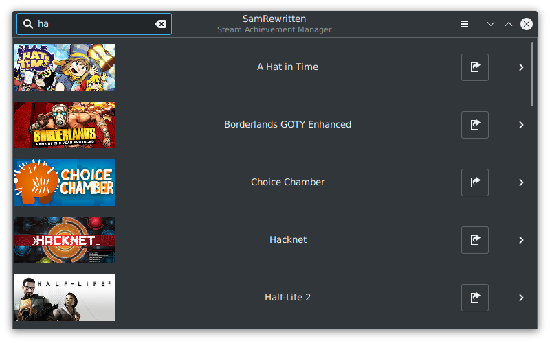
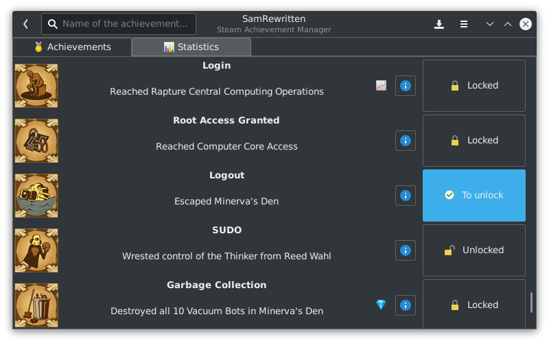

# SamRewritten
A Steam Achievements Manager for Linux
---

<p align=center>
	
</p>

<p align=center>
	
</p>

<p align=center>
	
</p>

# Introduction

SamRewritten is an open-source program that allows you to unlock and relock your Steam achievements. It is named after the famous Steam Achievement Manager written by Gibbed, and implements its functionalities on Linux, and more!

It comes with third-party tools integration and a nice user interface.

SamRewritten is constantly under development, if you think you can give us a hand, feel free to reach us :)

### ⚠️ As of now, SamRewritten only works if Steam has been installed through your package manager (apt, pacman, ...)

# Building

To build this project, clone this repository on your PC, and run the `make` command within the repository folder that you downloaded.

Alternatively, you can download one of our releases in the AppImage format. Check the 'Release' tab of this repository to find them.
To build your own AppImage, build SamRewritten normally, then execute `build_appimage.sh` in the `package` folder, it will take care of everything for you.

For Arch users, there is also a PKGBUILD within the `package` folder if you wish to build it using `makepkg`.

If you're encountering issues building SamRewritten, make sure you have installed the required packages on your machine. You'll most likely need Steam, curl, yajl, GTK 3, and GLib.

* **Ubuntu 18.04** and above: `$ sudo apt install libgtkmm-3.0-dev libcurl4-gnutls-dev libyajl-dev`

* **Arch** and variants: `$ sudo pacman -S gtkmm3 glibc gnutls yajl`

* **openSUSE** Tumbleweed, Leap 15.2+: `$ sudo zypper install gtkmm3 gcc-c++ gnutls libcurl-devel libyajl-devel-static`

* **Fedora 32+**: `$ sudo dnf install gtkmm30 gtkmm30-devel yajl-devel curl-devel g++`

To run SamRewritten, simply launch `$ ./bin/launch.sh`

## AUR Installation

You can install SamRewritten from the AUR by installing the `samrewritten-git` package.

Run SamRewritten by opening the corresponding desktop entry, or by using the `samrewritten` command.

## Gentoo Installation

SamRewritten is available as `games-util/samrewritten` through the GURU overlay:

https://wiki.gentoo.org/wiki/Project:GURU

# Features

SamRewritten's features match and exceed the original SAM:

* Ability to unlock/relock achievements and change stats
* Asynchronous and cached icon downloads for games and achievements
* Ability to select/deselect all achievements for locking/unlocking
* Ability to search games, achievements, and stats and filter achievements by locked/unlocked
* Ability to launch another SamRewritten instance for a game in a new window
* Protected achievements and stats are detected
* Ability to show percent of players who achieved an achievement
* Ability to time achievement modifications

This last one warrants some explanation. SamRewritten allows you to specify across what time period, with what spacing, and in what order to lock/unlock achievements. For example, you can unlock 10 achievements of your choice in a random order across 4 hours with random spacing between them. This is a powerful tool to allow you to make achievement management look more normal, rather than unlocking them all at once. This option can be accessed in the GUI by starting a game -> inputting the  achievement modifications -> click the menu -> Start Timed Modifications -> choose your parameters -> Submit. The same functionality can be used with the CLI as well via the `--timed` parameter - an example is given below.

# Command line options

I know you linux geeks love to use command line options! SamRewritten's commandline can do all the operations its GUI can! If no commandline arguments are given, the GUI will be launched.

```
Usage:
  samrewritten [AppId] [OPTION...]

      --apps                 	Get the list of your owned apps.
  -h, --help                 	Show CLI help.
  -a, --app arg              	Set which AppId you want to use. Same as using
                             	positional 'AppId'.
  -i, --idle                 	Set your Steam profile as 'ingame'. Ctrl+c to
                             	stop.
      --ls                   	Display achievements and stats for selected app.
      --sort arg             	Sort option for --ls. You can leave empty or set
                             	to 'unlock_rate'.
      --filter-achieved arg  	Filter option for --ls. You can use with 'yes'/'y'
                             	or 'no'/'n' to only filter achived or not achieved ones.
				Default is all.
      --filter-protected arg 	Filter option for --ls. You can use with 'yes'/'y'
                             	or 'no'/'n' to only filter protected or not protected ones.
				Default is all.
      --nostats              	Do not displays stats after achievements.
      --unlock arg           	Unlock achievements for an AppId. Separate
                             	achievement names by a comma.
      --lock arg             	Lock achievements for an AppId. Separate
                             	achievement names by a comma.
      --timed                	Do a timed achievement modification. Arguments
                             	that affect this are --amount, --units, --spacing,
                             	and --order
      --amount arg           	Control the amount of time spent for --timed
                             	modifications. Specify units with --units. Default
                             	is 1000
      --units arg            	Control the units of time spent for --timed
                             	modifications. Set to 'seconds', 'minutes', 'hours',
                             	or 'days'. Default is seconds
      --spacing arg          	Control the spacing between appying each
                             	modification for --timed modifications. Set to 'even' or
                             	'random'. Default is even.
      --order arg            	Control the order --timed achievement
                             	modifications are applied in. Set to 'selection' or
                             	'random'. Default is selection.
      --timestamps           	Displays timestamps before time related information.
      --statnames arg        	Change stats for an AppId. Separate stat names
                             	by a comma. Use with statvalues to name the values
                             	in order.
      --statvalues arg       	Change stats for an AppId. Separate stat values
                             	by a comma. Use with statnames to name the values
                             	in order.
  -p, --launch_achievements  	Launch SamRewritten GUI and immediately switch
                             	to achievements page for the app.
      --launch               	Actually just launch the app.
```

## Example Usage

Change an achievement or stat value:

```
# Find what you want from the --ls command for app id 54 (you can retrieve app ids from the store page URL).
samrewritten 54 --ls

# Say we found achievements with IDs ach_500_kills and ach_found_something and stats stat_num_kills, stat_num_deaths
# Modify them like this
samrewritten 54 --unlock ach_500_kills,ach_found_something
samrewritten 54 --statnames stat_num_kills,stat_num_deaths --statvalues 10,1
```

Use the timed unlock on the commandline

```
# Using the same achievements from the previous example
samrewritten 54 --timed --unlock ach_500_kills,ach_found_something --amount 4 --units hours --spacing random --order random
```

---

## Third-party apps integration

SamRewritten uses JSON to communicate between the interface and the "backend logic". Communications are transmitted via unix sockets. If you plan to make an app using some of SamRewritten's features, feel free to ask for help, for features, or to contribute.

## I want to contribute, where to start?

You can find an overview of SamRewritten's internal logic and more [here, in the doc folder](doc/OVERVIEW.md).

## Footnotes

This software is licensed under the GNU GPL v3 and comes with no warranty. Use it at your own risk. We believe you should not get any ban using it, but we do not take any responsibility over your user experience.
